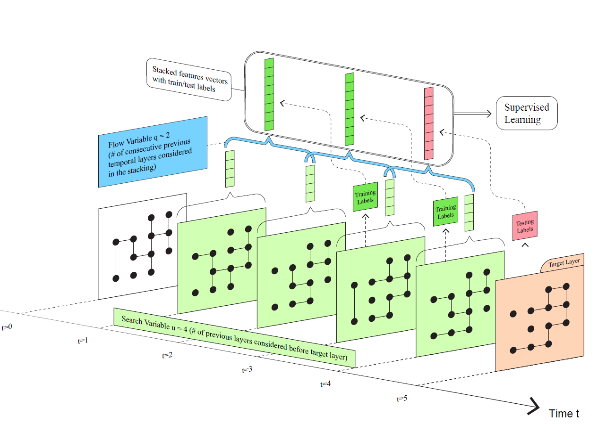

<div align="center">

</div>

<h2 align="center">Sequential Stacking Link Prediction </h2>

</div>


### Sequential Stacking Link Prediction Algorithms for Temporal Networks 

This is the github repo accompany the [paper by Xie He, Amir Ghasemian, Eun Lee, Aaron Clauset, Peter Mucha](https://www.researchsquare.com/article/rs-2535525/v1). 
The paper is currently under revision at Nature Communications. 

**Please cite the paper when using the data or code. See License Information for more details on Usage.**

**To ensure reproducbility, the below information has been tested and successfully run by vonlunteers who read the Github and then experimented on Linux, Mac, Windows, and Google Colab.**

### System requirements

To reproduce all results from our experiments, you will need at least Python 3.6.7 and a few packages installed(see the enviornment file for specific details). 

You can check your python version with

```bash
$ python --version
```

Use the commend

```bash
conda env create -f environment.yml
```

to create the required environmnet for the code (**Only if you want to use the full Ensemble-Sequential**, because of the dependency of [E-LSTM-D](https://github.com/jianz94/e-lstm-d), Time Series, and [T-SBM](https://github.com/seeslab/MMmultilayer)).

Alternatively, if you wish to run only the Top-Sequential or T-SBM method with the topological features, you could instead do:

```bash
pip install scipy numpy pandas networkx scikit-learn imblearn
```

If you further with to run Time Series, then you should also install:

```bash
pip install statsmodels
```

If you run into trouble with the above conda commends or the original E-LSTM-D Github, but you want to run the E-LSTM-D and the full Ensemble-Sequential method, then you should install: 

```bash
pip install python==3.6.15 scipy==1.4.0 tensorflow==1.14.0 keras==2.2.4 imblearn scikit-learn==0.19.0 networkx==2.5.1 pandas==1.0.5 statsmodels==0.13.5 numpy==1.14.5
```

The environment has been tested to build successfully and run the experiment successfully on all the popular platforms and should work for Windows, Mac OS, Linux, Google Colab, etc, if installed correctly. 


### To run only the Top-Sequential Experiments

The best way to run only the Top-Sequential Experiment is to follow the `example.py` file. 

```bash
$ python example.py
```
Change the variables and/or numbers in `example.py` to change the corresponding variables in the paper. 

Note that you have to manually determine the number of layers you want the algorithm to work with. 

- The search variable **u** could be found and replaced in `edges_orig = edges_orig[0:u]` (6 in all of our experiment)
- The flow variable **q** could be found and replaced in `predict_num = q` (3 in all of our experiment)

Running `example.py` (which contain two functions) will generate two AUC scores, accordingly with the partially observed case and the completely unobserved case in the paper. 


### To run Top-Sequential and the T-SBM without the whole Ensemble-Seqquential method (NOT VERY RECOMMENDED, but doable)

There's currently no way to run T-SBM individually in this directory, because what we have done for the paper and arguably the best way to run it individually will be to run it through its original Github [T-SBM](https://github.com/seeslab/MMmultilayer). 

You could get both the Top-Sequential AUC and the T-SBM AUC without the trouble of installing anything else. 

If you do not wish the run the full E-LSTM-D and Time Series, but are only interested in the toplogical feature + T-SBM, you could simply navigate to the folder, and run:

```
$ cd ensemble_with_others/Ensemble_final_edition
$ python data_runner.py # this will create the T-SBM features (which would be an edge indicator) and the Toplogical features
```

This will give you all the feature matrix you need to further use your preferred algorithm. 

If done correctly, you should see: "for_sbm", "feature_metrices", "results", "edge_tf_true", "edge_tf_tr", "ef_gen_ho", "ef_gen_tr". 

But you need to change the variable `feat_path` in the file `calculate_different_AUC.py` to your own feature path before proceed if you have **NOT** run the other two commands(see below for details). 

Because now that the order is disturbed, you need to load the feature matrix from the folder named `feat_path = "./ef_gen_tr/"` for the training matrix, and then `feat_path = "./ef_gen_ho/"` for the hold out matrix. Note also that you need to rename them in order to make `calculate_different_AUC.py ` recognize them. To be even more specific, the input of the  `calculate_different_AUC.py ` requires four different things: `df_t_tr` for the true training edges, 'df_f_tr' for the false training edges, and `df_t_ho` for the true hold out edges, and `df_f_ho` for the false holdout edges. Thus you should make sure that these files all exist before you do anything else. Likely they live in the previously mentioned folders, probably named to just be "df_t" and "df_f". 

To help the reader make this process easier, I have built the function `TOP_TSBM_postprocess.py` as a help function to make this process easier. Please put in the same folder as `data_runner.py`. Please be careful with this function as it **WILL OVERWRITE** the final output if you directly run it after you have successfully built everything. This file should be run **BEFORE** you call `python calculate_different_AUC.py`.  

```
$ python TOP_TSBM_postprocess.py
```

Thus, it is highly recommended that you finish the whole process first, or **at least finish the Time-Series part first** before you proceed to call `calculate_different_AUC.py`. 

Once you are sure that you have the feature matrix you want in the folder you want it in, go ahead and call: 

```
$ python calculate_different_AUC.py 
```

If you have run the other two in the order described above, then you can ignore the whole section above and directly call it, as this function is meant to be called after all the feature metrices has been generated. 

Very Importantly, in the file `calculate_different_AUC.py`, the main loop contain a variable named `choice`. 

The choice `0` gives you Top-Sequential AUC, choice `1` gives you Time-Series, choice `2` gives you T-SBM, choices `3` gives you E-LSTM-D, and choice `4` gives you Ensemble-Sequential-Stacking, just like what is described above. 

And in the case you have **NOT** run neither Time-Series nor E-LSTM-D, you only have the choice of `0` and `2`. Any other option will likely give you an error message. 


### To run Top-Sequential, T-SBM and Time-Series without the whole Ensemble-Seqquential method (RECOMMENDED Only if having a lot of trouble with E-LSTM-D)

```
$ cd ensemble_with_others/Ensemble_final_edition
$ python data_runner.py # this will create the T-SBM features (which would be an edge indicator) and the Toplogical features
$ python process_ts.py # this will create the time series features and add them to the end of the previous features.
```

If done correctly, there will be a folder named "all_features" appearing after the run. Replace the variable `feat_path` value in the file `calculate_different_AUC.py` to `all_features` and run

```
$ python calculate_different_AUC.py 
```

All the rest will be exactly the same as described in the above section. 


### To run the full Ensemble-Sequential Experiments (HIGHLY RECOMMENDED if E-LSTM-D works out fine)

Running the experiments will take a while depending on your hardware. In particular, both E-LSTM-D and T-SBM could be a bit slow even for smaller networks. 

For simplicity, here I only describe the process for the partially observed case, the completely unobserved case is done in the exact same setting, but with slightly different nameed python files (usually there's the word complete in the file name). 

To run the full Ensemble-Sequential experiment. You have to first:

1. Download and install the code and relevant packages from: [E-LSTM-D](https://github.com/jianz94/e-lstm-d)
2. Download and install the code and relevant packages from: [T-SBM](https://github.com/seeslab/MMmultilayer)
3. Make sure you have installed the required environment and packages.

First, you have to run the E-LSTM-D codes in order to get the features and AUC scores from it. See System Requirements for how to install the environments correctly. 

```bash
$ cd ensemble_with_others/E-LSTM-D/Partially-observed
$ python convert_partial.py
$ python calculate_elstmd.py
$ python generate_output.py
```

This will in turn gives you a full feature matrix from E-LSTM-D and a folder named "lstm_feat", which you could used to stack with the topological features extracted with Top-Sequential method. 

If you wish to get the AUC scores for E-LSTM-D, stop here. 

If not, please go ahead and copy and paste the folder `lstm_feat` to be under the same directory that you are planning to conduct your full Ensemble-Sequential method. (I intentionally avoid directly put it under that folder to avoid confusion of where does that output folder comes from.)

After that, navigate towards the folder `ensemble_with_others/Ensemble_final_edition/`, which is also the default folder that you should be pasting to. 

Once inside the folder you have to first generate the feature matrix for the dataset first. You can do this by:

```bash
$ python data_runner.py # this will create the T-SBM features (which would be an edge indicator) and the Toplogical features
$ python process_ts.py # this will create the time series features and add them to the end of the previous features.
$ python create_lstm_df.py # this will create the LSTM features. Omit this step if you have not done the E-LSTM-D part.
```

If done correctly, you should be seeing folders named  "finalized_all_features", "all_features",  "lstm_feat", "for_sbm", "feature_metrices", "results", "edge_tf_true", "edge_tf_tr", "ef_gen_ho", "ef_gen_tr". 

Then you could go ahead and call:

```
$ python calculate_different_AUC.py 
```

This will give you the complete AUC scores result of the dataset you desired. If left not touched, it will output to the folder named `full_results_final`. 

Very importantly, the AUC scores order that you will end up getting after the partially observed case should be in the following order: 

```
auc_methods = ['Top-Sequential-Stacking', 'Time-Series', 'Tensorial-SBM', 'E-LSTM-D', 'Ensemble-Sequential-Stacking',]
```

The AUC scores order that you will get after the completely unobserved case will be the same order, except that you will ignore the third column, `Tensorial-SBM`, because that would be a meaningless result that is repeating the partially observed case.  

Note also: feel free to use this ensemble learning method stacked with other features of your liking. Theoritically any features that could generated with a partially observed network would work with that case, and note also completely unobserved case would require features that could be generated from the previous time slot. 

**If there's any question, feel free to leave a message on Github or email directly.**


### To run the benchmarking methods mentioned in the paper individually

For E-LSTM-D:

1. Download and install the code and relevant packages from: [E-LSTM-D](https://github.com/jianz94/e-lstm-d)
2. Either you could then run their code directly to caluclate the AUC.
3. Or you could directly run the full Ensemble-Sequential code, which automatically generate the AUC scores after the full-run.

For Tensorial-SBM:

1. Download and install the code and relevant packages from: [T-SBM](https://github.com/seeslab/MMmultilayer)
2. Either you could then run their code directly to caluclate the AUC.
3. Or you could directly run the full Ensemble-Sequential code, which automatically generate the AUC scores after the full-run.

For Time Series: 

See above for detailed description. 

```
$ cd ensemble_with_others/Ensemble_final_edition
$ python data_runner.py # this will create the T-SBM features (which would be an edge indicator) and the Toplogical features
$ python process_ts.py # this will create the time series features and add them to the end of the previous features.
```


### Synthetic Datasets

The example runs could be found in example.py, which runs through one of the 90 synthetic network datasets we created.
To run through the synthetic networks, please download them through the [Google Drive Link](https://drive.google.com/drive/folders/1sfycenFPrYXBHSUlJ7ovEIYHFY5-mGg2?usp=drive_link) here. 
Once downloaded, go ahead and extract the folder into the same folder under `TOLP.py` and change the path name in the `example.py` and/or modify to your liking. 

Note that the naming of the synthetic networks could be very confusing. Here we list the naming pattern for both types of synthetic network so that the readers are not confused. We did the naming this way to avoid long and arduous names of the files.
For the naming convention, see the functions in the python file `translate.py` for specific details. 


### Real World Datasets

The real world networks could be found under the following links, due to copy right reasons, we will only show the link to download them:
The following is taken from ICON: https://icon.colorado.edu/#!/networks

- chess: Search for Kaggle chess players (2010) on : https://icon.colorado.edu/#!/networks
- bitcoin: Bitcoin Alpha trust network (2017): https://snap.stanford.edu/data/soc-sign-bitcoinalpha.html
- obitcoin: Bitcoin OTC trust network (2017): https://snap.stanford.edu/data/soc-sign-bitcoinotc.html
- obrazil: Brazilian prostitution network (2010): http://konect.cc/networks/escorts/
- london: London bike sharing (2014): https://github.com/konstantinklemmer/bikecommclust
- mit: Search for Reality mining proximity network (2004) on: https://icon.colorado.edu/#!/networks
- radoslaw:  Search for Manufacturing company email (2010) on: https://icon.colorado.edu/#!/networks

The following is taken from network repository:
- ant1-ant6: https://networkrepository.com/asn.php (see insect-ant-colony)
- emaildnc: https://networkrepository.com/email-dnc.php
- fbforum: https://networkrepository.com/fb-forum.php
- fbmsg: https://networkrepository.com/fb-messages.php

The following is given to us by the authors, special thanks to the authors for sharing the data. 
- bionet1-2: https://www3.nd.edu/~tmilenko/software_data.html
- Khalique Newaz and Tijana Milenkovic (2020), Improving inference of the dynamic biological network underlying aging via network propagation, IEEE/ACM Transactions on Computational Biology and Bioinformatics, DOI: 10.1109/TCBB.2020.3022767.

### Aknowledgements

Special thanks to Junyi Chen, Jonathan T. Lindbloom, Lizuo Liu, Ryan Maguire for their help during the progress of this project. 

### Previous Mistakes

You could also find the past bugged version of the code both in the same folder and on Github for debugging purposes. The noticable change could be found in the Github history.
There might still unfound BUGs, email me or leave a message as you see fit. 


